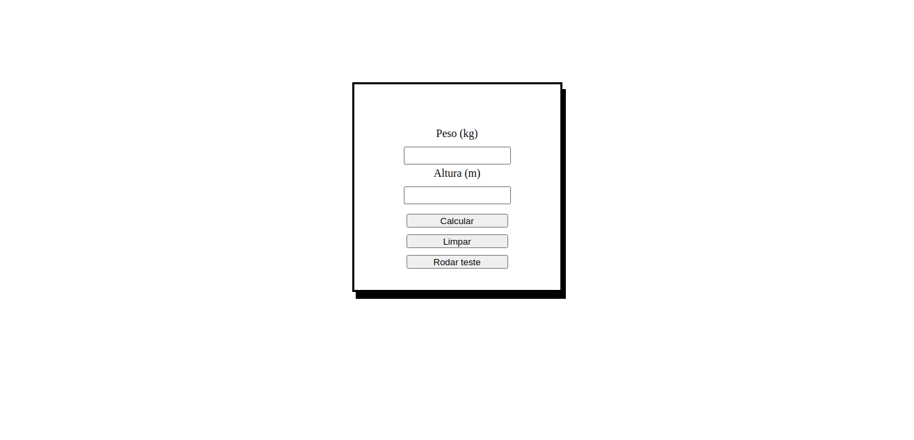

# IMCalc
Aplicação em JavaScript que calcula o Índice de Massa Corporal (IMC) de um usuário.

## Contexto
Exercício para obtenção do certificado iTalents de Introdução a Back-end.

## Testes
Os testes são mostrados aleatoriamente pela lógica implementada em JavaScript. São 5 testes registrados que podem ser escolhidos a cada vez que o botão `Rodar teste` é clicado. 
